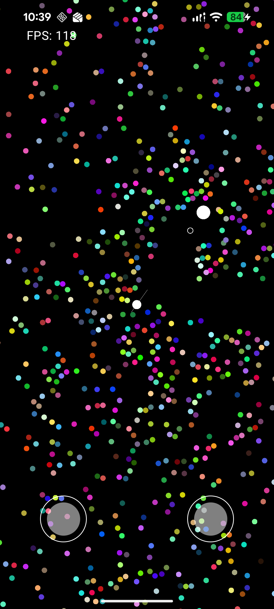
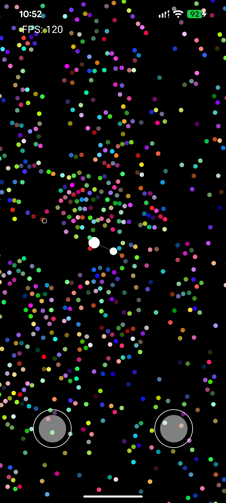
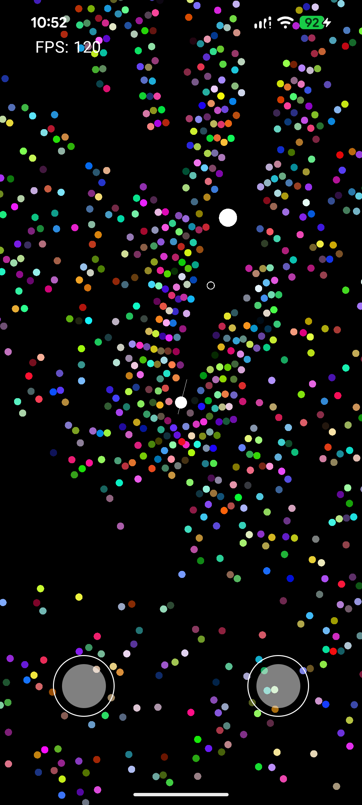

# 🎮 RogueLike — Android OpenGL ES 3.0 Game

<p align="center">
  
</p>

<p align="center">
  <a href="images/gameplay.mp4">▶️ Watch Gameplay Video</a>
</p>

---

A **rogue-like top-down shooter** built entirely from scratch on **Android** using **OpenGL ES 3.0** and **C++ (NDK)**. We got OpenGL, compute shaders, and custom game architecture.

---

## 📱 Platform & Tech Stack

| Layer | Technology |
|---|---|
| Platform | Android (API 26+) |
| Language (Native) | C++17 via Android NDK |
| Language (JVM) | Kotlin |
| Graphics API | OpenGL ES 3.1 (GLSurfaceView) |
| Math Library | [GLM](https://github.com/g-truc/glm) 1.0.3 |
| Build System | CMake + Gradle (Kotlin DSL) |
| JNI Bridge | Custom C++/Kotlin JNI bridge |
| Shaders | GLSL (vertex, fragment, compute) |

---

## 🎥 Gameplay Preview

> **[▶️ Click here to watch small the gameplay video](images/gameplay.mp4)**

<p align="center">
  
  &nbsp;&nbsp;&nbsp;&nbsp;
  
  &nbsp;&nbsp;&nbsp;&nbsp;
  
</p>

---

## 🕹️ Features

- 🧑 **Player** — smooth movement with joystick-style input, screen-space aim indicator, and a connecting line between player and aim
- 🎯 **Aim System** — a clamped aim position that stays within a max radius from the player
- 💥 **Bullets** — auto-firing projectiles every second in the aim direction, with a 5-second lifetime and GPU-side lifecycle management via compute shaders
- 👾 **Enemies (2 000+)** — GPU-simulated using **OpenGL Compute Shaders**; enemies chase the player, separate from each other via collision resolution, and react to bullets — all on the GPU
- 📷 **Smooth Camera** — exponential-smoothing camera that follows the player
- ⏱️ **Delta Time** — frame-rate-independent simulation via a static `DeltaTime` utility
- 📡 **SSBO Readback** — asynchronous GPU→CPU data readback via `GL_SHADER_STORAGE_BUFFER` for collision events, throttled to every Nth frame
- 🌈 **Emission-style rendering** — enemies rendered as glowing circles with random per-enemy RGB color

---

## 🏗️ Architecture Overview

The project follows a **layered native-first architecture**. All game logic runs in C++ on the NDK side; Kotlin serves only as the Android surface host and JNI bridge.

```
Kotlin (Android UI layer)
│
├── MainActivity          — activity host, GLSurfaceView setup
├── GameView              — touch input routing → JNI
└── GameRenderer (Kotlin) — GLSurfaceView.Renderer, forwards lifecycle to JNI
        │
        │  JNI (GameRendererBridge.cpp / ResourcesBridge.cpp)
        │
        ▼
C++ Native Game Engine
│
├── GameRenderer (C++)       — top-level game loop (init / update / draw / destroy)
│   ├── Camera               — smooth-follow camera (exponential lerp)
│   ├── Player               — movement, velocity capping, aim, IEnemyTarget impl
│   │   ├── PlayerRenderer   — circle quad render
│   │   ├── AimRenderer      — aim indicator render
│   │   └── LineRenderer     — player↔aim line render
│   ├── Enemy                — 2 000-agent GPU simulation
│   │   ├── Render shader    — vertex + fragment (point sprites, circle SDF)
│   │   └── Compute shader   — AI movement, separation, bullet collision
│   ├── Bullets              — projectile pool (max 50)
│   │   ├── Render shader    — vertex + fragment
│   │   ├── Compute shader   — movement, lifetime
│   │   └── Spawn shader     — finds first dead slot and activates bullet
│   └── SSBOReader           — GPU→CPU readback via GL_SHADER_STORAGE_BUFFER
│
├── base/
│   ├── Translation          — lazy model-matrix (position / scale / rotation / ratio)
│   ├── GLObjectData         — VBO/VAO wrapper
│   └── UniformLocations     — cached glGetUniformLocation results
│
├── time/
│   └── DeltaTime            — static delta-time updated every frame
│
└── utils/
    ├── ShaderUtil           — compile & link GLSL from assets
    ├── OpenglUtils          — helpers
    └── MathUtils            — math helpers
```

### Key Design Decisions

| Decision | Why |
|---|---|
| **Compute shaders for enemies** | Simulating 2 000+ agents each frame would be too slow on CPU; the compute shader runs entirely on the GPU in parallel |
| **SSBO readback throttled to every Nth frame** | `glMapBufferRange` stalls the pipeline; reading every other frame hides the latency |
| **`IEnemyTarget` interface** | Decouples the `Enemy` system from `Player` — anything that can be targeted just implements `getPosition()` |
| **`ISSBOBuffer` interface** | Allows `SSBOReader` to be injected into any system that needs GPU readback without hard coupling |
| **`Translation` struct with dirty flag** | Model matrix is only rebuilt when position/scale/rotation actually changes |
| **Lambda / `std::function` getters** | Camera and Player expose `getPositionFunction()` returning `std::function<glm::vec3()>` so consumers don't hold raw pointers to owners |
| **Assets loaded from APK** | Shaders live in `assets/shaders/` and are read at runtime via the Android `AAssetManager` bridge |

---

## 📂 Project Structure

```
app/src/main/
├── cpp/
│   ├── CMakeLists.txt
│   ├── GameRendererBridge.cpp      ← JNI entry points
│   ├── ResourcesBridge.cpp         ← Asset manager JNI
│   ├── assets/                     ← AAssetManager wrapper
│   └── game/
│       ├── GameRenderer.{h,cpp}
│       ├── time/DeltaTime.{h,cpp}
│       ├── utils/
│       ├── vbo/SSBOReader.{h,cpp}  ← GPU readback
│       └── objects/
│           ├── base/               ← Translation, GLObjectData, Uniforms
│           ├── primitives/         ← Plane geometry
│           ├── shaders/            ← ShadersPaths struct
│           └── entities/
│               ├── camera/
│               ├── player/         ← Player + renderers (aim, line)
│               ├── enemy/          ← Enemy + compute AI
│               └── bullets/        ← Bullet pool + compute lifecycle
│
├── java/ge/siradze/roguelike/
│   ├── MainActivity.kt
│   ├── GameView.kt
│   ├── GameRenderer.kt
│   └── extentions/
│
└── assets/shaders/
    ├── player/
    ├── aim/
    ├── line/
    ├── enemy/                      ← enemy_v.vert, enemy_f.frag, enemy_c.comp
    └── bullets/                    ← bullets_v.vert, bullets_f.frag,
                                      bullets_c.comp, bullets_spawn.comp
```

---

## 🔧 Building

1. Clone the repo
2. Open in Android Studio
3. Let Gradle sync (GLM is fetched via `FetchContent` in CMake automatically)
4. Run on a device or emulator that supports **OpenGL ES 3.1**

> ⚠️ OpenGL ES 3.1 (compute shaders) is required. Most Android devices from 2016+ support it.

---

## 📄 License

MIT — do whatever you want with it.

